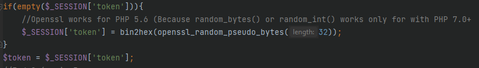

# STI Projet 2 - Analyse des menaces

**Auteurs : Lucas Gianinetti & Christian Zaccaria**

**Date : 04.01.2022**

### Table des matières

- [Description du système](#description-du-système)
	* [Objectifs](#objectifs)
	* [Hypothèses de sécurité](#hypothèses-de-sécurité)
	* [Identification du système](#identification-du-système)
	* [Rôles utilisateurs](#rôles-utilisateurs)
- [Liste de biens à protéger](#liste-de-biens-à-protéger)
- [DFD](#DFD)
- [Identification des sources de menaces](#identification-des-sources-de-menaces)
  - [Script-kiddies / Hackers](#script-kiddies--hackers)
  - [Cybercrime (SPAM, Maliciels)](#cybercrime-spam-maliciels)
  - [Utilisateurs avertis](#utilisateurs-avertis)
  - [Concurrents](#concurrents)
- [Scénarios d'attaque](#scénarios-dattaque)
  - [Scénario 1 - Intrusion dans le système par bruteforce](#scénario-1---intrusion-dans-le-système-par-bruteforce)
  - [Scénario 2 - Intrusion dans le système à l'aide d'une injection SQL](#scénario-2---intrusion-dans-le-système-à-laide-dune-injection-sql)
  - [Scénario 3 - Attaque d'éléments ayant un lien direct avec l'application](#scénario-3---attaque-déléments-ayant-un-lien-direct-avec-lapplication)
  - [Scénario 4 - Accès à des ressources non autorisés](#scénario-4---accès-à-des-ressources-non-autorisés)
  - [Scénario 5 - Suppression de ressource](#scénario-5---suppression-de-ressources)
  - [Scénario 6 - Sessions utilisateur attaquées (XSS)](#scénario-6---sessions-utilisateur-attaquées-xss)
  - [Scénario 7 - Vol de base de données](#scénario-7---vol-de-base-de-données)
  - [Scénario 8 - Vol d'informations / credentials en sniffant le réseau](#scénario-8---vol-dinformations--credentials-en-sniffant-le-réseau)
  - [Scénario 9 - Attaque infrastructure](#scénario-9---attaque-infrastructure)
- [Conclusion](#conclusion)

# Description du système

## Objectifs

L’application doit permettre la mise en œuvre d’une messagerie électronique au sein d’une entreprise. Cette messagerie sera une application Web uniquement et se base sur l’interaction avec une base de données (pas de SMTP ou autres protocoles de communication).

Une authentification simple (à l'aide de comptes utilisateurs) sera nécessaire afin d’accéder à l’application. Seule la page de login sera accessible sans être authentifié.

Chaque utilisateur peut se connecter et envoyer des messages destinés à un autre utilisateur du système. Deux types de rôles existent : `Administrateur` et `Collaborateur`. Un collaborateur est restreint à ne pouvoir qu’envoyer des messages tandis qu’un administrateur peut créer des comptes, les modifier, les supprimer et modifier les rôles.

## Hypothèses de sécurité

Utilisé uniquement dans un réseau interne (au sein d'une entreprise). 

On part de l'hypothèse que le système d'exploitation, serveur web, navigateur internet et langage de programmation utilisé sont tous à jour et de confiance.

## Exigences de sécurité

- Utilisation d'un compte (actif) pour utiliser l'application
- Les informations des utilisateurs sont protégées
- Les messages envoyés/ reçus sont confidentiels et protégés (intégrité garantie)
- Le contenu doit être protégé et non modifiable (intégrité garantie)
- Non-répudiation de l’origine/ l’arrivée des messages
- La création/ modification/ suppression de comptes est limitée aux administrateurs (actifs) et aucun autre rôle présent dans l’application ne doit pouvoir effectuer ces tâches.
- Service qui doit être disponible tout le temps (99,9999% du temps)

## Identification du système

### Base données utilisateurs / rôles

Comptes utilisateurs (`administrateurs / collaborateurs`) permettant de pouvoir interagir avec l'application : 

- Nom d'utilisateur (unique)
- Mot de passe
- Compte actif (détermine si il est possible d'utiliser l'application)
- Rôle (détermine si un compte est `administrateur` ou pas)

### Base données messages

Les messages envoyés au sein et à l'aide de l’application : ils sont sécurisés et lisibles que par la personne qui le reçoit/envoi.

- Date réception
- Emetteur 
- Destinataire
- Sujet du message
- Message

## Rôles utilisateurs

### Administrateur

- Envoi / réception de messages
- Création d’utilisateurs
- Modification d’utilisateurs
- Suppression d’utilisateurs

### Collaborateur

- Envoi / réception de messages

- Modification du profil (mot de passe)

# Liste de biens à protéger

- Infrastructure
- Base de données (Utilisateurs / Messages / Logs)

# DFD

# Identification des sources de menaces

## Script-kiddies / Hackers

Les manipulations effectuées sont facilement retrouvées dans les logs de l'application. Ces attaques sont effectuées à la main ou par des robots dans le but de tester des applications de manières « génériques » et sans but précis afin de voir si des failles s’y trouvent.

C’est donc une menace courante et élevée pour notre application.

- **Potentialité : Haute**
- Motivation : s'amuser, gloire
- Cible : n'importe quel élément actif 

## Cybercrime (SPAM, Maliciels)

Ayant une application de petite taille qui devra être utilisé uniquement au sein d'une entreprise, elle n'est pas forcément très intéressant pour des attaques destinées à voler des informations. La seule vraie ressource de nos applications (outre que les adresses e-mail) sont les messages (pouvant contenir des informations sensibles)

- **Potentialité : Moyenne**
- Motivation : Financière
- Cible : Vol d’informations sur les utilisateurs, spam

## Utilisateurs avertis

Les utilisateurs de l’application sont une source de menace élevée car ils ont accès aux fonctionnalités avancées. Par exemple, un employé mécontant d'un collègue peut tenter de saboter l’application en essayant de comprendre la structure de nos URL ou les fonctionnalités proposées par le service de messagerie. Un autre exemple : une plaisanterie entre collègues peut aussi mal tourner et amener un disfonctionnement dans l’application.

- **Potentialité : Elevée**
- Motivation : Lire des messages non destinés, modifier des messages
- Cible : Messages

## Concurrents

L’application étant destinée à envoyer des messages simples, contenant peut d'informations exploitables, une attaque pour les voler ne devrait pas avoir un impact élevé sur le business. Néanmoins, cela dépend encore une fois des messages qui sont échangés.

- **Potentialité : Moyenne**
- Motivation : Saboter le projet
- Cible n’importe quel élément

# Scénarios d'attaque

> Chaque scénario est décrit dans sa globalité (en gros), néanmoins des captures d’écran de notre application pour les parties contre-mesures et exemples d’attaques sont présents afin de montrer quelles genre de corrections nous avons effectué. 
>
> A noter que les corrections ne sont pas exhaustives, une modification de code pour éviter une injection ne sera montrée qu’à un seul endroit dans ce document mais la correction peut survenir à de nombreux endroits dans le projet.

## Scénario 1 - Intrusion dans le système par bruteforce

|              Cible               | Source de la menace |                       Motivation                        |                    Impact sur le business                    |
| :------------------------------: | :-----------------: | :-----------------------------------------------------: | :----------------------------------------------------------: |
| Système interne de l'application |       Hackers       | Défi, curiosité, revente d'informations confidentielles | **Impact élevé !** Vol d'identité, perte de confidentialité |

**<u>Scénario d'attaque :</u>** 

Un utilisateur (non connecté) va bruteforce la page de login pour pouvoir se connecter.

**<u>Exemple d'attaque :</u>** 

Connection à la page de login et utilisation d'un dictionnaire permettant d'essayer tout type de mots de passe en faisant des essais tant que nous restons sur la page de login.

**<u>Contre-mesure :</u>** 

- Mise en place d'un `Captcha` afin d'éviter ce genre d'attaque.

Modification formulaire HTML :

Modification code PHP :

- Augmenter la complexité des mots de passe (politique de mot de passe) afin d'augmenter le temps le temps de réussite de l'attaque.

*PAS mis en place dans ce projet car on ne gère pas la création de nouveau utilisateur, mais ceci peut être une bonne idée...*

- Filtrage IP (permettant ainsi la connexion uniquement au sein de l'entreprise) 

*PAS mis en place dans ce projet car on travail avec `localhost`, mais ceci peut être une bonne idée...*

## Scénario 2 - Intrusion dans le système à l'aide d'une injection SQL

|              Cible               | Source de la menace |                       Motivation                        |                    Impact sur le business                    |
| :------------------------------: | :-----------------: | :-----------------------------------------------------: | :----------------------------------------------------------: |
| Système interne de l'application |       Hackers       | Défi, curiosité, revente d'informations confidentielles | **Impact élevé !** Vol d'identité, perte de confidentialité, vol de données |

**<u>Scénario d'attaque :</u>** 

Injection de code SQL dans les différents champs des formulaires (login / mail) pour obtenir le contenu des différentes tables présentes dans la base de données afin de pouvoir avoir des privilèges plus élevés : afin de pouvoir faire ce que l'on souhaite avec l'application.

**<u>Exemple d'attaque :</u>** 

Injection d'une requête SQL dans le formulaire de `Login`

**<u>Contre-mesure :</u>** 

- Utilisation de méthodes spécifiques à PHP permettant de nettoyer les inputs.

*Dans le cadre du projet 1, notre projet contenait déjà différents filtres de nettoyages (notamment `FILTER_SANITIZE_STRING`) qui était utilisé pour chaque input du site dans un formulaire.* 

Voici un exemple lorsqu'on envoie un nouvel e-mail avec les 3 champs à remplir dans le formulaire :

## Scénario 3 - Attaque d'éléments ayant un lien direct avec l'application

|              Cible               | Source de la menace |                       Motivation                        |                    Impact sur le business                    |
| :------------------------------: | :-----------------: | :-----------------------------------------------------: | :----------------------------------------------------------: |
| Système interne de l'application |       Hackers       | Défi, curiosité, revente d'informations confidentielles | **Impact élevé !** Perte de confidentialité, vol de données, accès à tout le cœur de l'application (base de données) |

**<u>Scénario d'attaque :</u>** 

Lorsqu'un attaquant recherche les différentes technologies que notre application utilise, il va automatiquement essayer d'utiliser les credentials par défaut de ces technologies (par exemple pour une base de données : `phpmyadmin` ou `phpliteadmin`).

**<u>Exemple d'attaque :</u>** 

Se rendre sur la page `phpliteadmin.php` sur notre application et essayer de taper le mot de passe par défaut (`admin`) de la bonne version de notre `phpliteadmin` afin de pouvoir accéder à la base de données.

**<u>Contre-mesure :</u>** 

- Changement du mot de passe par défaut directement dans le fichier `phpliteadmin.php` sur notre serveur web. (chemin sur le serveur web présent sur Docker : `/usr/share/nginx/html`)

> A noter que lors de la connexion sur `phpliteadmin`, nous avons le message suivant qui apparait (lorsque le mot de passe était encore celui par défaut)
>
> 

## Scénario 4 - Accès à des ressources non autorisés

|              Cible               |        Source de la menace        |                          Motivation                          |                    Impact sur le business                    |
| :------------------------------: | :-------------------------------: | :----------------------------------------------------------: | :----------------------------------------------------------: |
| Système interne de l'application | Utilisateurs du système / Hackers | Usurpation d'identité, dérangements/nuisances, vol d'informations, revente d'informations | **Impact élevé !** Détournement possible, vol d'identité |

**<u>Scénario d'attaque :</u>** 

Modification de l'URL pour accéder directement à un message (notamment sur du contenu non autorisé). Pour ce faire, on peut le faire manuellement dans la barre URL de notre navigateur favori ou à l'aide d'outils (comme *Burp*) par exemple.

**<u>Exemple d'attaque :</u>** 

En modifiant les paramètre de l'URL (notamment la partie `id=X`), on a réussi depuis l'utilisateur *Steph* à accéder un message envoyé par *Dylan* ayant comme destinataire *Chris*. Dans ce cas malheureusement la surprise sera découverte .....

**<u>Contre-mesure :</u>** 

- Vérifier que l'`id` du message auquel l'utilisateur essaie d'accès soit bien un `id` (message) qui lui soit adressé

>  Ici on va vérifier que l'utilisateur qui essaie de consulter le message est bien de destinataire du message.
>
> Le cas écheant, on se retrouver avec cette page (sans aucun message)
>
> 

## Scénario 5 - Suppression de ressources

|              Cible               |        Source de la menace        |                          Motivation                          |                    Impact sur le business                    |
| :------------------------------: | :-------------------------------: | :----------------------------------------------------------: | :----------------------------------------------------------: |
| Système interne de l'application | Utilisateurs du système / Hackers | Usurpation d'identité, dérangements/nuisances, vol d'information,  vengeance, défi | **Impact élevé !** Détournement possible, vol d'identité |

**<u>Scénario d'attaque :</u>** 

Modification de l'URL pour supprimer un message (n'étant pas le destinataire du message) ou carrément supprimer un utilisateur (n'étant pas administrateur. Pour ce faire, on peut le faire manuellement dans la barre URL de notre navigateur favori ou à l'aide d'outils (comme *Burp*) par exemple.

Il est aussi possible d'effectuer cette attaque en envoyant par exemple un mail contenant un lien pointant vers une URL permettant de supprimer une ressource (utilisateur/message)

**<u>Exemple d'attaque :</u>** 

L'utilisateur va alors effectuer une requête HTTP ayant comme URL : `http://localhost:8090/deleteUser.php?username=abraham`. Ceci aura pour but de supprimer l'utilisateur `abraham`, mais aussi de nous rediriger directement vers la page de *Management des utilisateurs* (et ceci n'était pas de rôle `administrateur` forcément !). Ceci est du bien évidemment à la conception de notre application, mais avère une faille extrêmement efficace car elle permet ensuite d'administrer l'application comme bon nous semble !

> On remarque bien que l'on est pas **administrateur** car nous n'avons pas le menu `Users management` présent dans le `header` (encadré en vert) !

**<u>Contre-mesure :</u>** 

- Ne pas supprimer à l'aide d'une méthode `GET` (avec le `username` dans l'URL). Privilégier une méthode `POST` combiné à une protection CSFR afin qu'un utilisateur n'ayant pas le droit de suppression sur la ressource (utilisateur / message) ne puisse rien faire (ne puisse pas envoyer de requêtes afin de supprimer des ressources non autorisés).

> L'exemple ci-dessus est effectué avec la **suppression d'un utilisateur** :
>
> Création d'un `token` lors de la première connexion à l'application
>
> 
>
> Check lors de la requête de suppression afin de savoir si l'utilisateur qui l'a lancée. Dans le cas ou ces conditions échouent, l'utilisateur est automatiquement redirigé vers la page de `login` (**authentifié ou pas** : c'est le prix à payer pour essayer de contourner l'application ;) ).
>
> 
>
> Bouton (`form`) à cliquer lors de suppression d'un utilisateur. Dans le cas présent, si un autre utilisateur arriver tomber sur la page de gestion des utilisateurs, il sera bloqué aussi ! (D'où l'intérêt de cette `form`)
>
> 

Cette contre-mesure, est aussi **appliqué** dans le cadre de ce projet (visible uniquement dans le code et non dans ce rapport) :

- Suppression d'un message
- Modification d'un utilisateur

## Scénario 6 - Sessions utilisateur attaquées (XSS)

|              Cible               |   Source de la menace   |                          Motivation                          |                    Impact sur le business                    |
| :------------------------------: | :---------------------: | :----------------------------------------------------------: | :----------------------------------------------------------: |
| Système interne de l'application | Utilisateurs du système | Usurpation d'identité, dérangements/nuisances, vol d'information | **Impact élevé !** Détournement possible, vol d'identité |

**<u>Scénario d'attaque :</u>** 

Utilisation d'un formulaire du site pour stocker une faille XSS sur l’application et pouvoir voler des sessions et/ou provoquer une action non désirée à un utilisateur.

**<u>Exemple d'attaque :</u>** 

Sur le formulaire pour écrire un nouveau message, on peut insérer dans un champ le texte suivant par exemple : ``. Ceci va alors produire le résultat qu'une *popup* va s'ouvrir avec le contenu de `alert`.

**<u>Contre-mesure :</u>** 

- Limiter la taille des champs des formulaires pour éviter des attaques (dans ce cas le message sera tronqué après *X mots*)

- Utilisation de fonctions de nettoyage (par forcément celle vu dans le [Scénario 2](#scénario-2---intrusion-dans-le-système-à-laide-dune-injection-sql)) comme `HTMLENTITIES` que nous allons utilisé pour chaque variable `$_POST` que le formulaire nous retourne.

- Utilisation d'un framework (*OWASP AntiSamy*) --> [AntiSamy](https://owasp.org/www-project-antisamy/)

## Scénario 7 - Vol de base de données

|     Cible     | Source de la menace |                    Motivation                    |          Impact sur le business           |
| :-----------: | :-----------------: | :----------------------------------------------: | :---------------------------------------: |
| Infrastucture |       Hackers       | Curiosité, vol d'identité, revente d'information | **Impact élevé !** Vol d'information |

**<u>Scénario d'attaque :</u>** 

Un hacker parvient à accéder à la base de données afin d'y lire tout son contenu.

**<u>Exemple d'attaque :</u>** 

A l'aide d'une faille dans notre application ou du serveur Web, un utilisateur/hacker parvient à entrer dans notre base de données (ou arrive exécuté des requêtes SQL) afin de pouvoir y copier les tables / Dump la base de données.

**<u>Contre-mesure :</u>** 

- Sécuriser l'infrastructure (serveur web) en patchant les dernières failles et toujours mettre à jour !

- Encrypter et hasher toutes le contenu de la base de données.

> Dans le cas présent on a seulement hasher les mots de passes afin de pouvoir montrer au moins une contre-mesure.
>
> Dans le cas présent nous utilisons la fonction de hash `PASSWORD_DEFAULT` (car une fonction comme typiquement `PASSWORD_ARGON2ID` n'est possible qu'à partir de PHP 7.2+)
>
> 

## Scénario 8 - Vol d'informations / credentials en sniffant le réseau

|     Cible      |        Source de la menace        |                          Motivation                          |                    Impact sur le business                    |
| :------------: | :-------------------------------: | :----------------------------------------------------------: | :----------------------------------------------------------: |
| Infrastructure | Utilisateurs du système / Hackers | Dérangements/nuisances, vol d'information, revente d'information | **Impact élevé !** Détournement possible, vol d'identité |

**<u>Scénario d'attaque :</u>** 

Sniffing du réseau afin d'y voir passer les trames TCP/IP (couche *Transport*) et les paquets *HTTP* (couche *Application*) pour pouvoir voir les informations qui y transitent.

**<u>Exemple d'attaque :</u>** 

Capture Wireshark du réseau afin d'y voir un utilisateur se connecter à l'application pour pouvoir savoir son `username` ainsi que `mot de passe`.

**<u>Contre-mesure :</u>** 

- Utilisation de *HTTPS* (pas démontrer dans le cadre de ce laboratoire car on travaille en `localhost` et qu'il faudrait aussi déployer un *certificat SSL* : ceci dépasse le projet car il concerne infrastructure et non l'implémentation de l'application en soi.)

## Scénario 9 - Attaque infrastructure

|     Cible      | Source de la menace |                          Motivation                          |                    Impact sur le business                    |
| :------------: | :-----------------: | :----------------------------------------------------------: | :----------------------------------------------------------: |
| Infrastructure |       Hackers       | Dérangements/nuisances, vol d'information, revente d'information, arrêt de service | **Impact élevé !** Détournement possible, vol information, hors-service |

**<u>Scénario d'attaque :</u>** 

Utilisation d'un serveur web contenant des vulnérabilités connues (par exemple une version non mise à jour / ultérieure) / utilisation d'un langage de programmation obsolète ayant des failles connues.

**<u>Exemple d'attaque :</u>** 

- Attaque pouvant être similaire au [Scénario 8](#scénario-8---vol-dinformations--credentials-en-sniffant-le-réseau)
- Attaque spécifique au langage de programmation / serveur web (par exemple un *Buffer Overflow* dans `Apache mod_isapi` ou `Microsoft IIS ISAPI Extensions, versions 4 et 5`.

**<u>Contre-mesure :</u>** 

- Mise à jour en permanence du serveur web (par exemple dans notre cas on utilise **PHP 5.6** et on pourrait migrer sur **PHP 7.0+**)
- Mise en place d'outils de IDS et contre les attaques DDos. 

# Conclusion

En état des lieux, nous avons traité toutes les failles que nous avons trouvé / cherché. Nous sommes conscients qu'il en existe surement d'autres tout autant vulnérables que celles que nous vous avons proposé ici. 

De plus, il est important de noter qu'il n'existe quasiment pas dans ce rapport les failles au niveau de l’infrastructure du projet.
