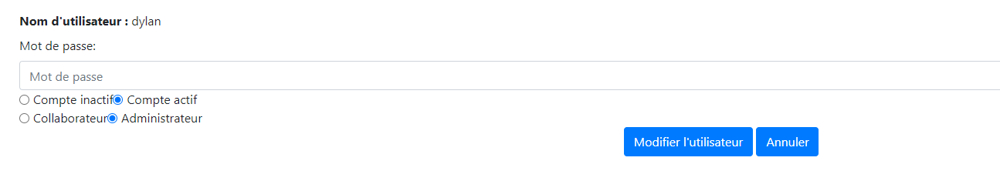

# STI-Projet1_Canton_Zaccaria

###### Christian Zaccaria & Dylan Canton

###### Date : 30.09.2021

---

## 1. Installation de l'infrastructure

* Il est tout d'abord nécessaire d'avoir un Docker fonctionnel sur la machine. 

* Lancer ensuite le script `run-services.sh` qui se trouve dans le dossier `STI-Projet1_Canton_Zaccaria`. Ce script : 
  * Supprime le container `sti_project` si celui-ci est déjà existant.
  * Lance un container docker nommé `sti_project` et effectue un mapping du port 8080 de la machine hôte vers le port 80 du container.
  * Copie les fichiers de l'application web et de la base de donnée dans le container.
  * Pour finir, lance le service web ainsi que le service PHP.

A ce stade, le container docker est fonctionnel et contient tous les fichiers nécessaires à l'application web.

## 2. Accéder à l'application web

* L'application web est accessible à l'adresse `localhost:8080` sur votre navigateur. 

  

## 3. Identifiants

Voici la liste des identifiants créés, ces derniers sont soit *actif*, soit *inactif*. De plus, différents e-mail de tests ont déjà été générés.

| Username | Password | Statut du compte et rôle |
| :------: | :------: | :----------------------: |
|  dylan   | sti2021  |  Actif + Administrateur  |
|  chris   | sti2021  |   Actif + Utilisateur    |
| abraham  | sti2021  | Inactif + Administrateur |
|  steph   | sti2021  |   Actif + Utilisateur    |

## 4. Manuel utilisateur
### Login

Voici la page accessible depuis l'adresse `localhost:8080`, il est nécessaire de se loguer au travers des identifiants fournis ci-dessus afin de pouvoir procéder.

### Accueil

Voici la page d'accueil de la messagerie, cette dernière contient tous les messages reçus triés par date de réception.

Depuis cette page, il est possible de :

- Ecrire un nouveau message à l'aide du bouton **New message.**
- Modifier son mot de passe et consulter son compte à l'aide du bouton **Account.**
- Se déconnecter avec le bouton **Logout.**
- Gérer des utilisateurs à l'aide du bouton **Users managements** (disponible uniquement si le compte actuel à un rôle `administrateur`).
- Lister les messages reçus.

Pour chaque message reçu, il est possible d'effectuer 3 actions à l'aide des boutons encadrés en rouge :

- **Détail** : Lecture du message
- **Répondre** : Répondre directement au message
- **Supprimer** : Suppression du message

### Visualisation d'un message

Lorsque l'action *Détails* est sélectionnée, le message reçu est visualisé dans une nouvelle fenêtre, il est alors possible (à l'aide des boutons présents) d'y répondre, de le supprimer ou de revenir à l'accueil.

### Répondre à un message

Lorsqu'on répond à un message (à travers le détail du message / dans l'accueil) divers champs sont automatiquement remplis :

- Destinataire
- Sujet
- Partie du message (encadrée en rouge)

### Compte 

Il est possible de visualiser les informations du compte en cliquant dans le menu le bouton **Account**. 

On peut y voir les informations relatives au compte ainsi que de changer son mot de passe en remplissant le champ encadré en rouge et cliquez **Changer le mot de passe**.

Il est possible de retourner à l'accueil à l'aide du bouton **Retour aux messages**.

### Gestion d'utilisateurs

Lorsqu'un utilisateur est `administrateur`, un bouton **Users management** apparaît dans le menu :

Une fenêtre apparait permettant de visualiser chaque utilisateur et de pouvoir effectuer des actions.

Pour chaque utilisateur il est possible de :

- Modifier l'utilisateur selectionné
- Supprimer l'utilisateur

#### Modification utilisateur

Lors du clic sur `Modifier l'utilisateur`, il est possible de :

- Modifier le mot de passe
- Activer / désactiver le compte
- Changement de rôle (Collaborateur - Administrateur)

#### Création d'un utilisateur

Lors du clic sur `Créer un nouvel utilisateur`, il faut ajouter :

- Nom d'utilisateur
- Mot de passe
- `Compte Inactif` ou `Compte actif`
- Rôle `Collaborateur` ou `Administrateur`

## 5. FAQ

Il est possible qu'il soit impossible d'ouvrir l'application web, il est très probable alors qu'un service utilise déjà le port `8080`. 

Pour modifier le port, il est nécessaire de modifier le script `run-services.sh` en modifiant le port (par exemple par le port `8090`). Voici la commande à modifier :

